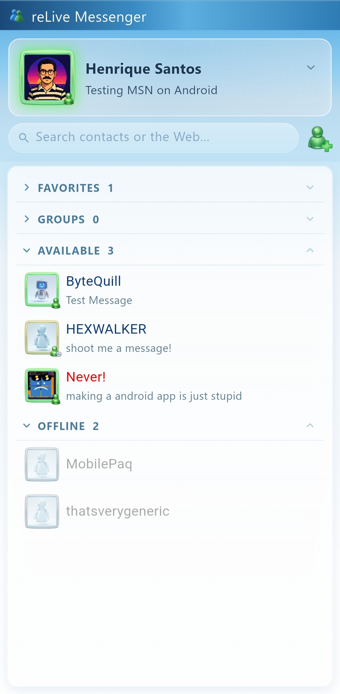
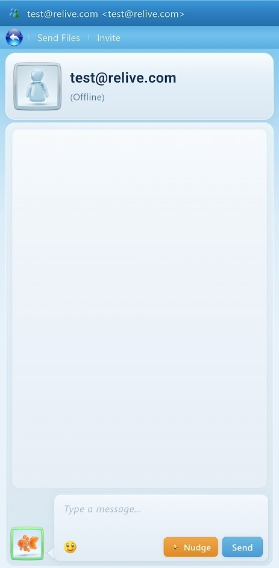
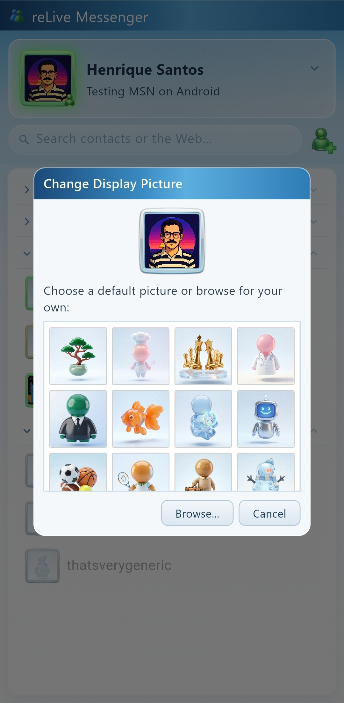

# reLive Messenger

A functional vibe-coded proof of concept re-imagination of how Windows live messenger could look if revived for Android.

---

## Screenshots

  
  &nbsp;&nbsp;
  
  &nbsp;&nbsp;
  

---

## Features

- **Contact list** - Grouped by Favorites, Groups, Available, and Offline with real-time presence updates
- **Chat window** - Message balloons, emoticons, nudges, and typing indicators
- **Display pictures** - P2P avatar exchange with contacts, plus a built-in default picture gallery
- **Emoticons** - Classic WLM 2009 emoticon set with shortcode support
- **Notifications** - Android-native notifications for incoming messages and nudges, with contact avatars
- **Presence & status** - Set your display name, personal message, and online status
- **Sound effects** - Authentic notification sounds for messages, nudges, contacts online, and more
- **Offline Chat** - Original OIM logic

## Compatibility

reLive is a **WLM 2009–compatible client** that implements the MSNP protocol for interoperability with legacy Messenger-era networks and clients.

Currently only supports accounts on [crosstalk.im](https://crosstalk.im)
I advise seeing this project as a mere prof of concept of what a modern client of WLM could look if properly developed by a capable team instead of this current vibe coded atempt.

## Download

v0.1.2 can be found in the [Releases](../../releases) page.

Due to the backlash originated by the use of AI-generated code and assets in this project, it will not be further developed, i will be happy though if by any chance someone reviews the source code and can help to improve it for my own learning purpose and my belief that there is space for an android WLM client.

---

## Disclaimer

This is an **unofficial, independent project intended for my personal use**.

- The assets used in this recreation are AI-generated from text descriptions of the original resources.
- Not affiliated with, endorsed by, or sponsored by Microsoft Corporation.
- Not affiliated with or endorsed by Crosstalk.
- Compatible with legacy Windows Live Messenger–era clients and protocols where supported.
- "Windows Live Messenger" is a trademark of Microsoft Corporation.

---

